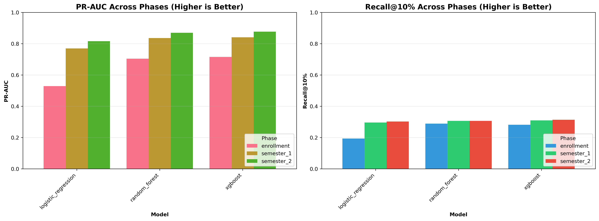

# Student Retention Forecasting

Machine learning project for predicting student dropout risk using the UCI Student Dropout and Academic Success dataset.

## Overview

This project builds a **production-ready retention forecasting model** to predict which students are at risk of dropping out, enabling early intervention by academic advisors.

**Key Highlights:**
- Prevents temporal leakage with phased modeling (enrollment → semester 1 → semester 2)
- Uses operational metrics (PR-AUC, Recall@K) instead of just accuracy
- Achieves **28% recall with top 10% of students** flagged at enrollment
- Provides calibrated probabilities and interpretable risk tiers

## Dataset

- **Source**: [UCI Machine Learning Repository - Student Dropout and Academic Success](https://archive.ics.uci.edu/dataset/697/predict+students+dropout+and+academic+success)
- **Size**: 4,424 students with 36 features
- **Features**: Demographics, academic background, socioeconomic factors, and semester performance
- **Target**: Dropout / Enrolled / Graduate

## Project Structure

```
student-retention-forecasting/
├── src/                      # Core Python modules
├── notebooks/                # Three analysis notebooks (EDA → Training → Results)
├── models/                   # Saved models and outputs
├── requirements.txt          # Python dependencies
└── environment.yml           # Conda environment
```

## Quick Start

### Installation

**Option 1: Using pip**
```bash
git clone https://github.com/adityaarun2/student-retention-forecasting
cd student-retention-forecasting
python -m venv venv
source venv/bin/activate
pip install -r requirements.txt
```

**Option 2: Using conda**
```bash
git clone https://github.com/adityaarun2/student-retention-forecasting
cd student-retention-forecasting
conda env create -f environment.yml
conda activate student-retention
```

### Run the Notebooks

```bash
jupyter notebook
```

Run in order:
1. **01_eda_and_feature_phases.ipynb** - Data exploration and temporal feature grouping
2. **02_model_training_and_evaluation.ipynb** - Train and compare models across phases
3. **03_calibration_and_results.ipynb** - Calibrate probabilities and generate final results

## Methodology

### Temporal Phases (Prevents Data Leakage)

| Phase | Timing | Features | Use Case |
|-------|--------|----------|----------|
| Enrollment | At admission | 24 | Earliest intervention opportunity |
| Semester 1 | After 1st semester | 30 | Refine predictions with early performance |
| Semester 2 | After 2nd semester | 36 | Final assessment (limited intervention time) |

### Models

- **Logistic Regression**: Linear baseline
- **Random Forest**: Non-linear ensemble method
- **XGBoost**: Gradient boosting (best performance)

### Evaluation

- **PR-AUC**: Better than ROC-AUC for imbalanced data
- **Recall@K**: Operational metric for limited advisor capacity
- **Calibration**: Ensures reliable probability estimates

## Results Preview



The XGBoost enrollment model achieves:
- **PR-AUC: 0.715** (strong performance on imbalanced data)
- **Recall@10%: 28%** (catch 28% of dropouts by helping top 10% of students)
- **Recall@20%: 46%** (catch nearly half of dropouts with top 20%)

Risk tiers show clear discrimination:
- **Low risk** (<30%): ~12% actual dropout rate
- **Medium risk** (30-60%): ~35% actual dropout rate
- **High risk** (≥60%): ~58% actual dropout rate

*Full results, visualizations, and analysis available in notebook 03.*

## Key Takeaways

1. **Temporal leakage matters** - Never use future data in early predictions
2. **Accuracy is misleading** - Focus on PR-AUC and Recall@K for imbalanced problems
3. **Earlier = more intervention time** - Enrollment models enable proactive support
4. **Calibration enables decisions** - Reliable probabilities support better thresholds

## Ethical Considerations & Limitations

**Ethical Concerns:**
- Risk of bias and disparate impact across demographic groups
- Potential for stigmatization through "at-risk" labels
- Privacy and responsible data handling required

**Limitations:**
- Model trained on one institution may not generalize
- Cannot capture all dropout factors (mental health, family issues, etc.)
- Predicts risk, not intervention effectiveness

## References

- **Dataset**: Realinho, V., Machado, J., Baptista, L., & Martins, M. V. (2021). *Predicting Student Dropout and Academic Success*. UCI Machine Learning Repository.

## Contributing

This project can be extended with:
- Hyperparameter tuning
- Fairness audits
- Deep learning approaches
- Additional feature engineering

---